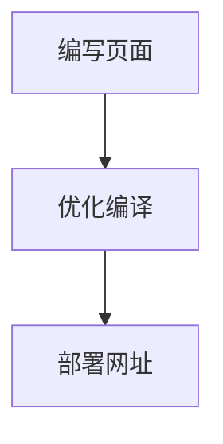

# 免费的搭建一个自己的博客

想要一个自己的博客，有没有钱买一个自己的服务器怎么办。

那么可以首先考虑 **Github Page** 这种形式的静态页面挂载。这样当 Github Page 的加载速度已经满足不了的时候，也可以将网站的挂载至自己的域名和服务器。

:::tip

静态页面就是实际已经存在的页面，不能在页面上运行程序。仅仅做展示用的博客正好是这样的。

:::


那么如何从零开始搭建一个免费的博客呢。

## 搭建博客的流程

## 技术选型
为了方便将自己的优质博客发布到其他网站上，博客的撰写格式应该是 markdown，也就.md结尾的文件形式。同时为了减少开发页面的工作量，可以选择一个成熟的框架。

这里我选择的是vuepress@2.0框架。

[vuepress已经讲了为什么使用vuepress框架](https://v2.vuepress.vuejs.org/zh/guide/#%E4%B8%BA%E4%BB%80%E4%B9%88%E4%B8%8D%E6%98%AF)。我这里只讲我为什么不用2.0不用1.0的一些原因。

* 2.0的文档更加详尽
* 2.0的配置文件支持ts(很重要，1.可以通过ts类型文件查看配置而不是只能搜文档，2.错误配置的时候静态类型也能快速地检查出来)
* vite的打包支持(1.更加快速 2.配置文件改变后能热加载替换 @1.0只能重新启动,配置过vuepress的时候会很痛苦)


## 快速地搭建及部署
由于这方面vuepress的文档已经很详尽了，这里可以直接按照他的官方文档来：

[快速上手vuepress](https://v2.vuepress.vuejs.org/zh/guide/getting-started.html#%E6%89%8B%E5%8A%A8%E5%AE%89%E8%A3%85)

[部署至GitHub pages](https://v2.vuepress.vuejs.org/zh/guide/deployment.html#github-pages)

完成后,我的博客地址预览:[点击](http://localhost:8080/Blog/)


## 附：一些快速的配置

```js
import { defineUserConfig } from "vuepress";
import { defaultTheme } from "@vuepress/theme-default";
import backToTopPlugin from "@vuepress/plugin-nprogress";

export default defineUserConfig({
  base: "/Blog/",                 // 网站的基础地址
  head: [                         // 网站的小图标
    [
      "link",
      {
        rel: "icon",
        href: "./avator.png",
      },
    ],
  ],
  title: `op-chen's Blog`,        // 博客的title
  description: "op-chen's Blog",  // 博客的介绍
  plugins: [backToTopPlugin()],   // 快速返回Top的插件
  theme: defaultTheme({
    logo: "./avator.png",         // 导航栏左上角的logo
    darkMode: true,               // 暗黑模式开启
    navbar: [                     // 导航栏的额外按钮
      {
        text: "Home",
        link: "/",
      },
    ],
    sidebar: {                     // 侧边栏目录                 
      "/": [
        {
          text: "JS相关",
          collapsible: true,
          children: ["/Js/handwrite"],
      ],
    },
  }),
});
```

### 自动化部署(CI/CD)

很简单，网站开发好了。由于是静态页面，那么每次只要我们在本地修改完源码然后再 build，然后把build的后的源码放到github pages上就可以

可是好麻烦，自从使用过CI/CD后，一个没有自动化构建的项目是没有灵魂的！那就使用 github 的自动化流程就好了。

在本地项目中新建.github/workflows 文件，创建 learn-github-actions.yml

具体可以查看如何使用 github actions 官方文档

这里附上我的配置，标注出了可能需要自己手动的配置的选项

```yml
name: Build and Deploy
on: [push]
jobs:
  build:
    runs-on: windows-latest # 本地使用的 windows 系统构建
    steps:
      - name: Checkout 🛎️
        uses: actions/checkout@v3

      - name: Install and Build 🔧 
        run: |
          npm ci
          npm run build

      - name: Upload Artifacts 🔺
        uses: actions/upload-artifact@v1
        with:
          name: site
          path: build # 构建后生成文件夹

  deploy:
    concurrency: ci-${{ github.ref }}
    needs: [build] 
    runs-on: ubuntu-latest
    steps:
      - name: Checkout 🛎️
        uses: actions/checkout@v3

      - name: Download Artifacts 🔻 
        uses: actions/download-artifact@v1
        with:
          name: site

      - name: Deploy 🚀
        uses: JamesIves/github-pages-deploy-action@v4.3.2
        with:
          branch: gh-pages
          folder: 'site' # The deployment folder should match the name of the artifact. Even though our project builds into the 'build' folder the artifact name of 'site' must be placed here.
```
## 迁移至docusaurus

因为个人原因，我将vuepress的博客迁移至docusaurus。

因为目前对react的组件封装更加熟悉，且希望精进此方面的功底

如果你希望在md中使用react组件，那么应该直接选用docusaurus而不是vuepress

谢谢！**vupress**