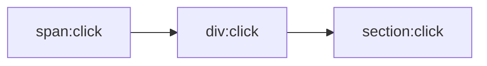

# 事件冒泡、事件捕获、事件委托

## 事件传播

在浏览器中，你可能察觉到了，当事件发生后，这个事件就要开始传播(从里到外或者从外向里)。

为什么要传播呢？因为事件源本身（可能）并没有处理事件的能力，即处理事件的函数（方法）并未绑定在该事件源上。

例如我们点击一个按钮时，就会产生一个```click```事件，但这个按钮本身可能不能处理这个事件，事件必须从这个按钮传播出去，从而到达能够处理这个事件的代码中（总之是浏览器级别的实现）

* 那么对如何传播这个事件有两种方式

  **1. 网景浏览器实现的事件冒泡（现代浏览器的实现）:事件从子元素传播到父元素**

  **2. IE浏览器实现的事件捕获:事件从父元素传播到子元素**

* **事件代理（事件委托): 由于事件传播的存在，可以将事件绑定到父元素以处理子元素的相同事件**

## 事件冒泡的举例

如果前面还有点不理解，我们这里可以举个例子

不过由于IE已经进坟墓了，我们可以只举例事件冒泡

```tsx
<section onClick={(e) => {
  console.log('section click')   
  }}
>
  <div onClick={(e) => {
      console.log('div click')
    }}
  >
    <span onClick={(e) => {
        console.log('span click')   
      }}
    >点击此处</span>
  </div>
</section>

// span click
// div click
// section click

// 如果是事件捕获，那么输出顺序是 section、div、span
```



## 阻止事件冒泡

业务上常常有需求我们的点击按钮不需要子元素传播到父级元素的事件上，那么我们如何防止一个点击事件传播出去呢？

根据[w3school](https://www.w3school.com.cn/jsref/event_stoppropagation.asp)定义:

```stopPropagation()```方法防止调用相同事件的传播。

传播意味着向上冒泡到父元素或向下捕获到子元素。

```tsx
<section onClick={(e) => {
  console.log('section click')   
  }}
>
  <div onClick={(e) => {
      console.log('div click')
      e.stopPropagation()
    }}
  >
    <span onClick={(e) => {
        console.log('span click')   
      }}
    >点击此处</span>
  </div>
</section>

// div click
```

不过 ```e.stopPropagation()``` 仅可以阻止相当事件的传播，不可以阻止不同事件的传播。


