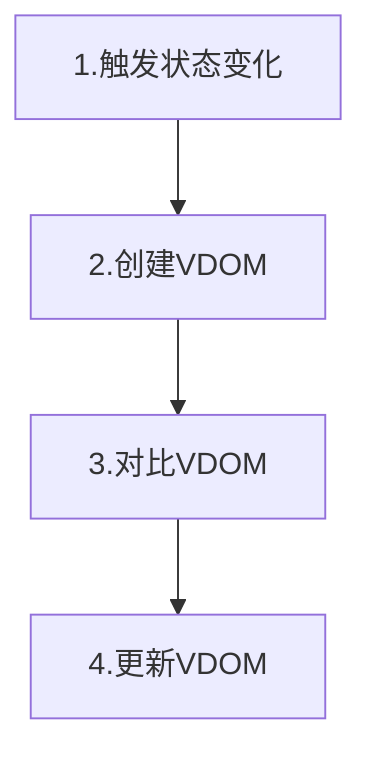
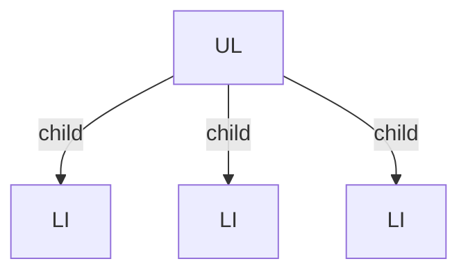
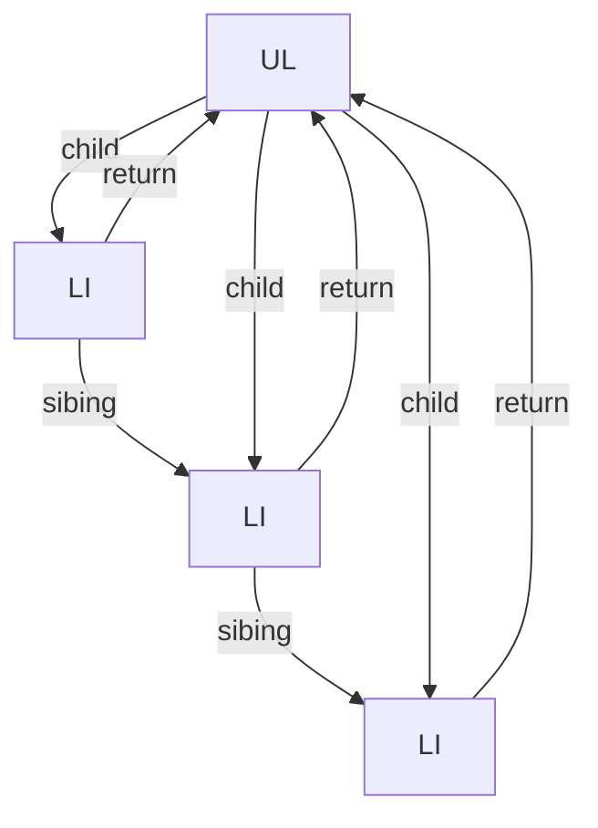
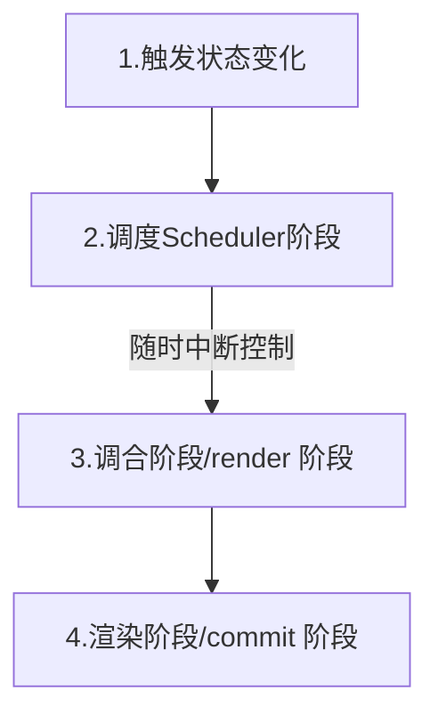
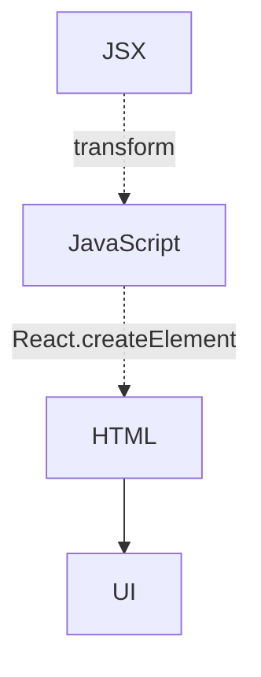

# React 原理

## 简要的渲染原理

`Web`开发中，我们需要将变化的数据**实时**显示在页面上，这个时候需要**`DOM`操作**，但是频繁的`DOM`操作通常是复杂繁琐的。因为我们需要精确地找到状态变化的`DOM`进行替换，而项目又多了许多与业务操作不相关的`DOM`操作。

因此`React`引入了**虚拟`DOM`**的机制——**每当数据变化时，`React`会重新构建起整个虚拟`DOM`树，然后将虚拟`DOM`树和上一次的虚拟`DOM`树进行对比，最终将需要变化的部分进行浏览器`DOM`的更新。**

总的来说，一次状态变化包含以下流程：



根据这四步，`React`团队将`React15`的架构分成两层：
* 调和阶段（Reconciler）：负责找出变化的组件，也就是流程2，3。
* 渲染阶段（Renderer）：负责将变化的组件渲染到页面上，也就是流程4。

### 调和阶段(Reconciler)

我们通常使用类组件中`this.setState`、`this.forceUpdate`、`ReactDOM.render`等`API`触发更新。
每当有更新发生的时候，Reconciler会做以下工作
1. 获取`render()`方法中的`JSX`，将其转换成`VDOM`
2. 将此次更新的`VDOM`与上次更新时的`VDOM`进行对比
3. 找出变化的`DOM`
4. 通知`Renderer`将变化的虚拟`DOM`渲染到页面上

### 渲染阶段(Renderer)

因为`React`支持不同平台的渲染，所以不同平台将使用不同的`Renderer`。通常`Web`环境下使用的`Renderer`是`ReactDOM`。

除此之外还有：
* `ReactNative`：渲染App原生组件
* `ReactTest`：渲染App原生组件
* `ReactArt`：渲染Canvas，SVG

### 简要渲染原理总结

`React`通过这两个阶段将原本需要人工找到变化的`DOM`并进行精准更新的流程大大简化了，从此我们只需要关注业务，也就是状态的变化，这也是`VDOM`体系的核心竞争力。

不过`React`的缺点也浮出水面，创建前后`VDOM`（虚拟`DOM`），对比`VDOM`是需要计算资源的。  

`React`和`Vue`的通过递归生成`VDOM`，对比`VDOM`，由于是递归执行的，所以计算一旦开始，中途就无法中断。不过二者在计算`VDOM`上是有差异的：

`React`是通过`setState()`等`API`触发状态更新的，更新以后就重新计算整个组件。

而`Vue`是通过响应式的代理管理状态，`get`的时候收集依赖，在修改状态的时候触发对应组件的更新。

所以`React`是将组件作为追踪更新的最小单元，而`Vue`将变量作为追踪更新的最小单元。因此`React`在计算`VDOM`时需要的计算量远大`Vue`。

`React`的性能瓶颈因此诞生了，这个问题也导致了后来两者架构上逐渐有了差异。

可以说在`React:v17`之前，`React`的原理是比较简单明了的。但是目前`React`是一个很复杂的框架，特别`Fiber`和`Hooks`的概念，这也是目前`React`生态不可或缺的组成部分。

## Fiber架构

在引入Fiber架构前，我们可以很明确的知道React的性能瓶颈在于递归执行计算并渲染VDOM。因此如何优化调和阶段这个流程就成了首要问题。既然这个任务量太重无法在合理的时间内执行完毕，那么我们应该怎么做呢？

答案是时间切片，通过原本的长执行时间任务切成一帧范围内的任务，我们就可以做到在不影响页面性能的情况下计算。

因此为了做到时间切片这个概念，我们需要将原本任务变成可打断的。那么如何做成可打断的任务呢：
1. 中断后需要在下次的任务中找到原本的计算位置
2. 将递归计算改成可随时中断的计算

### 数据结构记录任务位置

```typescript
// Fiber的数据结构，列举几个主要属性
type Fiber = {
  // 标签
  tag: WorkTag // 目前为整数 0-25 分别代表类型不同的组件 0 代表 FunctionComponent，1 代表 ClassComponent...;
  // 父级
  return: Fiber
  // 子级
  child: Fiber
  // 邻级
  sibing: Fiber
  // 更新队列
  updateQueue: any
  // 记录状态
  memoizedState: any
  // 依赖上下文
  dependencies: contexts | events | null
  // 渲染这个Fiber及其后代的时间，每次渲染都会重置为0。
  actualDuration?: number,
  // ...
}
```

因此`Fiber`数据结构相比之前，除了记录渲染必需的`child`信息，还多了`sibing`，`parent`等信息。

原先的数据结构示意图：


Fiber数据结构示意图：


举个例子，当我们在LI节点时有更高优先级别的任务，那么我们将会打断此次计算去执行高优先级的任务，执行之后在回到这个节点上。按照曾经的数据结构。我们无法知道接下来需要如何计算。而Fiber结构中还有额外信息（sibing）指导目前的任务进度，因此可以再中断后继续进行计算。
### 循环流程

有了可以记忆中断前状态的数据结构，如何将递归计算改成可中断的呢？

在新的React中是使用一个循环来进行做到的
```typescript
function workLoopConcurrent() {
  while (workInProgress !== null && !shouldYield()) {
    performUnitOfWork(workInProgress);
  }
}
```
如果当前浏览器帧没有剩余时间，`shouldYield`会中止循环，直到浏览器有空闲时间后再继续遍历

因此新的`React`处理一次`setState()`时会有三个阶段：

* 调度阶段（Scheduler）：根据浏览器是否有剩余帧时间，是否有更高优先级任务调度任务调合任务。
* 调和阶段（Reconciler）：负责找出变化的组件。
* 渲染阶段（Renderer）：负责将变化的组件渲染到页面上。

在新的架构中：
* 调和阶段（Reconciler）又被称为 render 阶段，因为该阶段会调用组件的 render 方法。
* 渲染阶段（Renderer）又被称为 commit 阶段，因此此阶段就像是git commit将代码提交一样，commit阶段会把render阶段提交的信息渲染在页面上。
* render 和 commit 阶段被统称为work，即在React工作中。如果在Scheduler内调度，就不属于work。

所以新的流程如下图所示：


#### render 阶段
render 阶段主要是两个方法，这两个方法的主要功能是将Fiber节点组织成 Fiber 树：
* beginWork：该方法会根据传入的Fiber节点创建子Fiber节点，并将这两个Fiber节点连接起来。
* completeWork：当某个Fiber节点执行完completeWork，如果其存在兄弟Fiber节点（即fiber.sibling !== null），会进入其兄弟Fiber的beginWork方法，如果不存在兄弟Fiber，会进入父级Fiber的completeWork方法。最终将rootFiber completeWork完毕，render阶段的工作就结束了。
#### commit 阶段
进入 commit 阶段，commit阶段主要分成三部分：
* before mutation 之前（执行DOM操作前），主要做一些变量赋值，状态重置的工作，在此阶段调度useEffect
```typescript 
// 调度useEffect
if ((effectTag & Passive) !== NoEffect) {
  if (!rootDoesHavePassiveEffects) {
    rootDoesHavePassiveEffects = true;
    scheduleCallback(NormalSchedulerPriority, () => {
      // 触发useEffect
      flushPassiveEffects();
      return null;
    });
  }
}
```
在此处，被异步调度的回调函数就是触发useEffect的方法flushPassiveEffects。
为什么需要异步？因为同步执行的话，将会阻塞浏览器渲染。

* mutation 阶段（执行DOM操作），遍历effectList，根据effectTag的不同，分别处理
  * Placement effect 插入节点
  * Update effect 更新节点，更新节点分成FunctionComponent以及HostComponent
    * FunctionComponent mutation 将会执行所有useLayoutEffect 的销毁函数
    * HostComponent mutation
  * Deletion effect 删除节点，将会执行如下操作
    * 递归调用Fiber节点及其子孙Fiber节点中fiber.tag为ClassComponent的componentWillUnmount (opens new window)生命周期钩子，从页面移除Fiber节点对应DOM节点
    * 解绑ref
    * 调度useEffect的销毁函数

* layout 阶段（执行DOM操作后），该阶段的代码都是在DOM操作完成后执行，因此触发的生命周期和hook可以直接访问到改变后的DOM。和mutation 阶段一样，layout 阶段也是遍历 effectList。


了解了整个 Fiber 的渲染流程，对Fiber的概念有一定的了解，那么 Hooks 又是如何作用于的呢
## Hooks原理

hooks 们作为**一条链表**保存在组件内部，为什么需要使用链表结构？因为我们组件的 hooks 数目是不可预知的，因此使用链表结构可以组成一条可随时扩容的结构体。

### useRef
其实是保存一个数据的引用，这个引用不可变。因此我们声明的是一个对象，对象中有一个不可变的current属性，使用`Object.seal()`包裹，来保存这个值引用值。
### useCallback
useCallback传入两个参数，第一个参数是回调函数，第二参数是deps。

更新的时候把之前的memorizedState取出来，和新传入的deps做对比。如果没变就返回之前的回调函数，如果变了就返回新的回调函数。
### useMemo

useMemo也传入两个参数，第一个是传入函数的执行结果，第二参数是deps。

更新的时候也是把之前的memorizedState取出来，和新传入的deps做对比。如果没变就返回传入函数的执行结果，如果变了就返回新的回调函数。

### useState

state改了之后要触发更新的调度

### useEffect
同样地，effect传入的函数也是被React所调度的。

所以useState、useEffect 这种 hooks的实现是 fiber 的空闲调度。


最后我再简单的写下JSX是什么？
## JSX 是什么

**[为什么需要JSX？](https://zh-hans.reactjs.org/learn/writing-markup-with-jsx) **

JSX是Javascript的语法扩展，可以让你在Javascript中书写类似HTML的标记。

JSX本质上编译为以下代码：
```typescript
React.createElement(tag,{id:"xxx"/*标签属性*/},[child1,child2,...]/*子元素*/)
```

正如以下示意图：

