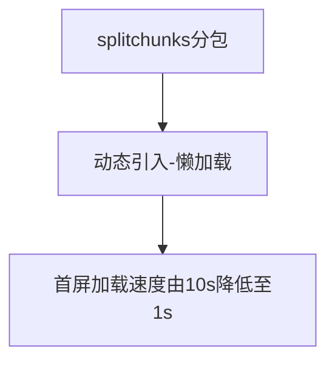

# 代码分离优化首屏加载

## 1.背景
在开发过程中，发现首屏加载过慢导致用户体验不佳(大约需要10秒左右)。

>造成原因是因为我们使用的前端工程化程度不够，原本是将所有的文件通过webpack打包后放在一个文件中，大约为60+MB。\
>因此我们首先想到的就是使用代码分离的方法将多个包分离

在优化过程中可谓是踩坑无数，百思不得其解，到最后发现是不过如此。但是网上一篇完整的叙述都很少，经常是使用webpack的默认例子。因此想要写篇博文来记录一下自己的一些实践。

## 2.优化手段

首先明确目标，是使用代码分离的方式来优化首屏加载速度，优化的流程大致如下：

在webpack中有关于代码分离的[文档介绍](https://webpack.docschina.org/guides/code-splitting#root)
总的来说webpack是可以帮助我们做到资源的去重和分离，去重就是将重复的引用减少，**分离将不同的资源包分离在不同的包内**

## 3.SplitChunksPlugin
我们很快地找到这个插件和配置，应该才是webpack帮助代码分离的关键
其默认配置为

```javascript
module.exports = {
  //...
  optimization: {
    splitChunks: {
      chunks: 'async',
      minSize: 20000,
      minRemainingSize: 0,
      minChunks: 1,
      maxAsyncRequests: 30,
      maxInitialRequests: 30,
      enforceSizeThreshold: 50000,
      cacheGroups: {
        defaultVendors: {
          test: /[\\/]node_modules[\\/]/,
          priority: -10,
          reuseExistingChunk: true,
        },
        default: {
          minChunks: 2,
          priority: -20,
          reuseExistingChunk: true,
        },
      },
    },
  },
};
```

通过默认配置我们可以看到我们分了两个包，cacheGroup和default，可是在实践中分离的包呢？
别急！其实主要是在chunks中已经有其设置，关键字为"async"，该关键字是说明只有代码为**主包未立即引入的第三方依赖，才会进入到此cacheGruop中**来。所以添加**chunks:"initial"**

```javascript
 defaultVendors: {
	test: /[\\/]node_modules[\\/]/,
 	priority: -10,
    chunks: 'initial',
    reuseExistingChunk: true,
},
```

就可以看到**在首屏加载**的时候，我们的defaultVendors 包出现了！

## 4.第三方依赖动态加载（懒加载）

那么如何将我们的第三方插件在需要的时候才加载呢，这个时候就需要用到我们的**动态加载**了，在webpack中也有过js动态加载的描述，主要是通过ECMAScript 提案 的 import() 语法 或require.ensure来实现
不过三大框架均有自己推荐的动态导入方案：
>* React: [Code Splitting and Lazy Loading](https://reactjs.org/docs/code-splitting.html)
>* Vue: [Dynamic Imports in Vue.js for better performance](https://vuedose.tips/dynamic-imports-in-vue-js-for-better-performance)
>* Angular: [Lazy Loading route configuration and AngularJS + webpack = lazyLoad](https://angular.io/guide/router#milestone-6-asynchronous-routing)

因此只要通过推荐的方案进行动态导入
> 一般而言针对单页面spa网站，将**路由懒加载**就可以将大多数首屏不需要的第三方依赖抽离出来
> 设置好引入后，那么我们的第三方依赖就成功从主程序中抽离出来

## 5.继续分包

然而很多时候，一股脑将第三方包在某一路由加载时，**异步地将一个包加载进入程序中**，不是一个很好的选择。\
配置优化，一般而言这个时候就需要用到webpack打包分析的插件[webpack-bundle-analyzer](https://github.com/webpack-contrib/webpack-bundle-analyzer)，通过插件可以分析出你的bundle，一般而言将**某些大库分成不同的包就可以了**。
这里附上将monaco，echarts,xlsx分离的示例：

```javascript
module.exports = {
  //...
	optimization: {
 		//...
		cacheGroups: {
  		//...
			monaco: {
				test: /[\\/]monaco-editor[\\/]/,
				name: 'monaco',
				reuseExistingChunk: true
			},
			echarts: {
				test: /[\\/](echarts-for-react|echarts|zrender)[\\/]/,
				name: 'echarts',
				reuseExistingChunk: true,
			},
			xlsx: {
				test: /[\\/]xlsx[\\/]/,
				name: 'xlsx',
				reuseExistingChunk: true,
			}
		}
	}
},
```
**这样就将某些大库分成小小包，在将在特定路由的时候加载小小包就可以了。**

## 附1:编译问题
在项目实践中发现动态引入一直无效，没有被webpack的splitChunks识别为动态的引入。可以从**ts编译**和**babel编译**入手
这里将ts的"module":改写成"es2020"及以上才可以被识别动态导入，附上我们的配置

```json
{
	"compilerOptions": {
		"experimentalDecorators": true,
		"target": "es5",
		"lib": ["es5", "es6", "dom"],
		"jsx": "react",
		"module": "es2020",
		"allowSyntheticDefaultImports": true,
		"skipLibCheck": true,
		"resolveJsonModule": true,
		"moduleResolution": "node",
		"baseUrl": "./",
		"downlevelIteration": true,
		"paths": {
			"@/*": ["src/*"]
		}
	},
	"include": ["src/**/*.ts", "src/**/*.tsx"],
	"exclude": ["node_modules"]
}
```

## 附2:继续优化
没有最好只有更好，虽然我们成功地将代码分离了。\
目前我可以看到的是还有这些点可以优化：
1. 可以将不必要的引入去除（**按需引入**），将第三方库通过es语法**import { }按需引入**而不是import * 这种形式（发现内部库没有做到按需引入的可以自己尝试去做）
2. 路由使用模块，尽量将公共组件放在一起，将路由和路由使用的库放在一个模块中，这样在加载某一路由的时候不会因为**使用到了另一个路由的代码而将另一个路由同时加载出来**（ps：使用了react的我竟然有些怀念Angular？）
3. 首屏使用ssr渲染